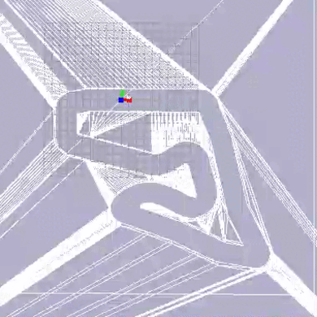
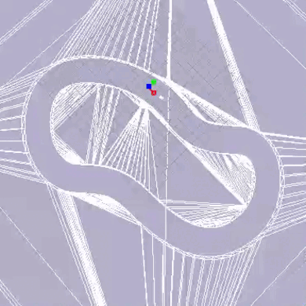
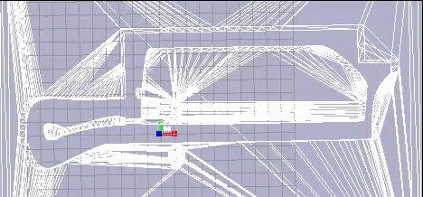

# Constrained Residual Race: An Efficient Hybrid Controller for Autonomous Racing
Deep reinforcement learning (DRL) has great potential for solving 
the autonomous racing problem, 
and this approach does not require an accurate dynamics model compared
to classical methods. However, the random sampling of actions
by a single DRL method results in large sample consumption
and inefficient exploration. In this paper, we propose an efficient
racing method based on constrained residual reinforcement
learning called Constrained Residual Race (CRR). First, we use
a geometry-based reactive obstacle avoidance algorithm 
Follow-The-Gap Method (FTG) as a prior controller to generate safe
guided actions. In addition, we generate complementary actions
using the DRL and finally fuse the two action outputs into the
final control action through a constraint equation. The prior
controller FTG algorithm produces safe driving actions and
improves the exploration efficiency of the agent. The constraint
treatment of the DRL policy output ensures that the DRL
policy does not overwrite the prior policy at the beginning of
the exploration. In addition, the DRL policy can improve the
performance of the prior controller during training and thus
reduce the lap time of the car. We validate our method on the
F1TENTH simulator, and the evaluation results show that our
method achieves the lowest lap times in most cases and exhibits
outstanding generalization capability.

## Demos
The results of our method on the four tracks, in order Austria, Berlin, Columbia and Treitlstrasse.

  

 


## Installation
Our code has been tested on `Ubuntu 20.04` with `Python 3.6` and `Tensorflow 2.3.0`. 

This F1TENTH simulator used the repository [racecar_gym](https://github.com/axelbr/racecar_gym).

DRL algorithm is based on [OpenAISpinningUp](https://github.com/openai/spinningup)
```
git clone https://github.com/openai/spinningup.git 
cd spinningup 
pip install -e . 
git clone https://github.com/axelbr/racecar_gym.git
cd racecar_gym
pip install -e .
pip install tensorflow==2.3.0 

```

To implement our setup in the experiment, 
please use file ```racecar.yml``` to replace 
```racecar.yml``` in 
```racecar_gym/models/vehicles/racecar/racecar.yml```.

## Training

By running file ```CRR.py``` for agent training, 
it is possible to change the track parameter in file ```CRR.py``` to achieve training on other tracks.

```
python CRR.py
```

## Acknowledgment

We use the following code in our project

* [ResRace](https://github.com/kaixindelele/ResRace)
* [SpinningUp](https://github.com/openai/spinningup)
* [Racecar_gym](https://github.com/axelbr/racecar_gym)
